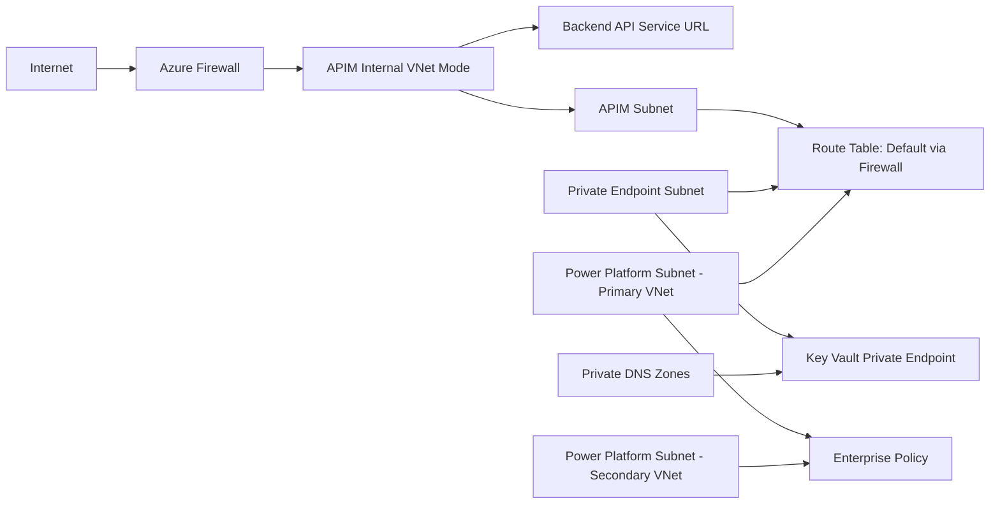

# Infosys CCD API Platform Terraform

This repository provisions a secure Azure API platform for Infosys workloads using Terraform and Azure Verified Modules (AVM).

It creates:
- Resource Group
- Virtual Network with dedicated subnets for Firewall, APIM, Private Endpoints, and Power Platform
- APIM-focused NSG and additional NSGs
- Azure Firewall + Firewall Policy + Route Tables
- Key Vault with Private Endpoint and Private DNS integration
- Azure Monitor Log Analytics workspace and diagnostics
- API Management (APIM) service with imported OpenAPI specification
- APIM Product and Subscription
- Power Platform Enterprise Policy (Network Injection)
- Optional secondary Power Platform VNet in paired region + optional VNet peering

## Repository Structure

- [main.tf](main.tf): Core infrastructure resources and module orchestration
- [variables.tf](variables.tf): Input variables and validations
- [terraform.tfvars](terraform.tfvars): Environment-specific values (example currently included)
- [provider.tf](provider.tf): Terraform and provider requirements
- [backend.tf](backend.tf): Backend configuration (currently local backend)
- [output.tf](output.tf): Key outputs after deployment
- [openapi_infosys_travel_accommodation.yaml](openapi_infosys_travel_accommodation.yaml): OpenAPI file imported into APIM

## High-Level Architecture



## Prerequisites

- Terraform 1.5.0 or later
- Azure subscription with permissions to create networking, APIM, firewall, Key Vault, and policy resources
- Azure CLI authenticated to target subscription
- Access to register required Azure resource providers if not already registered

## Providers and Versions

Defined in [provider.tf](provider.tf):
- hashicorp/azurerm ~> 4.0
- azure/azapi ~> 2.0

## Backend

Defined in [backend.tf](backend.tf):
- Local backend is currently configured

For team usage, switch to a remote backend (for example Azure Storage backend) before collaborative deployments.

## Configuration

Update values in [terraform.tfvars](terraform.tfvars) to match your environment:
- Naming conventions
- CIDR ranges
- Region and Power Platform region pairing
- APIM SKU
- Power Platform enterprise policy name

Important configuration notes:
- power_platform_region must be one of the allowed values in [variables.tf](variables.tf).
- resource_group_location should match one of the mapped Azure regions for the selected Power Platform geography to ensure correct primary/secondary pairing behavior.
- enable_vnet_peering can be set to true or false.
- If peering is false, network reachability between primary and secondary Power Platform VNets must still be guaranteed.

## Deploy

Run from the repository root:

```powershell
terraform init
terraform fmt -recursive
terraform validate
terraform plan -out tfplan
terraform apply tfplan
```

To destroy:

```powershell
terraform destroy
```

## What Gets Created

From [main.tf](main.tf), the deployment includes:
- Resource Group via AVM module
- APIM NSG with inbound/outbound rules for APIM networking requirements
- Primary VNet with 4 subnets:
- AzureFirewallSubnet
- APIM subnet
- Private Endpoint subnet
- Power Platform delegated subnet
- Key Vault with private endpoint in Private Endpoint subnet
- Private DNS zones for Key Vault, Blob, and File endpoints
- DNS zone links to primary VNet and conditional secondary VNet
- Azure Firewall and firewall policy with route table default route
- APIM in Internal mode, API import from OpenAPI, product, and subscription
- Secondary Power Platform VNet in paired region (conditional)
- Optional bidirectional VNet peering (conditional)
- ARM template deployment for Power Platform enterprise policy
- Log Analytics workspace + diagnostics

## Outputs

See [output.tf](output.tf) for exported values, including:
- Resource Group name and ID
- VNet and subnet IDs
- Secondary VNet details
- Firewall ID and private IP
- APIM ID
- VNet peering warning message

## How to Add More APIs

This project already contains one API configured in the apis block inside [main.tf](main.tf). To add more APIs, follow this process.

### Step 1: Add OpenAPI spec file

- Place your new OpenAPI file in the repo root or a dedicated folder.
- Keep naming clear, for example:
- openapi_order_management.yaml

### Step 2: Add API entry in APIM module

In module avm-res-apimanagement-service, extend the apis map with a new key.

Example pattern:

```hcl
apis = {
  "travel-accommodation-api" = {
    display_name = "Infosys Travel & Accommodation API"
    path         = "travel-accommodation"
    protocols    = ["https"]
    service_url  = "https://itgatewaytst.infosys.com/infydigital"
    api_type     = "http"
    import = {
      content_format = "openapi"
      content_value  = file("${path.module}/openapi_infosys_travel_accommodation.yaml")
    }
  }

  "order-management-api" = {
    display_name = "Order Management API"
    description  = "Order APIs"
    path         = "order-management"
    protocols    = ["https"]
    service_url  = "https://example.contoso.com/orders"
    subscription_required = true
    api_type     = "http"
    import = {
      content_format = "openapi"
      content_value  = file("${path.module}/openapi_order_management.yaml")
    }
    policy = {
      xml_content = <<-XML
<policies>
  <inbound>
    <base />
    <rate-limit-by-key calls="200" renewal-period="60" counter-key="@(context.Request.Headers.GetValueOrDefault("subscription-key", ""))" />
  </inbound>
  <backend>
    <base />
  </backend>
  <outbound>
    <base />
  </outbound>
  <on-error>
    <base />
  </on-error>
</policies>
XML
    }
  }
}
```

### Step 3: Add API to product

In the products map, update api_names to include the new API key.

Example:

```hcl
products = {
  "travel-accommodation-product" = {
    display_name = "Travel & Accommodation APIs"
    api_names    = [
      "travel-accommodation-api",
      "order-management-api"
    ]
    subscription_required = true
    approval_required     = false
    published             = true
  }
}
```

You can also create a separate product if lifecycle, audience, or access model is different.

### Step 4: Add subscription (optional but recommended)

Create a dedicated subscription per product or consumer group.

Example:

```hcl
subscriptions = {
  "travel-accommodation-subscription" = {
    display_name     = "Travel Accommodation Default Subscription"
    scope_type       = "product"
    scope_identifier = "travel-accommodation-product"
    state            = "active"
    allow_tracing    = true
  }

  "order-management-subscription" = {
    display_name     = "Order Management Subscription"
    scope_type       = "product"
    scope_identifier = "travel-accommodation-product"
    state            = "active"
    allow_tracing    = true
  }
}
```

### Step 5: Validate before apply

```powershell
terraform fmt -recursive
terraform validate
terraform plan
```

### Step 6: Apply

```powershell
terraform apply
```

### Step 7: Post-deployment checks

- Confirm API appears in APIM
- Confirm product association is correct
- Verify subscription keys are generated
- Test through APIM gateway endpoint
- Validate APIM policies (rate limit, headers, auth)

## API Onboarding Checklist

Use this checklist every time a new API is added:
- OpenAPI file is valid and committed
- Unique API key in apis map
- Unique path for APIM routing
- Correct backend service_url
- Product association updated
- Subscription strategy defined
- API-level and/or product-level policy reviewed
- Plan reviewed for unintended infrastructure changes
- Smoke tests executed after apply

## Security and Operations Notes

- APIM is configured in Internal VNet mode; ensure private connectivity from consumers.
- Key Vault public network access is disabled.
- Route table sends default egress via Azure Firewall.
- Diagnostic settings are enabled for key services into Log Analytics.
- Review NSG and firewall rules before production rollout.

## Recommended Improvements

- Move from local backend to remote state with locking.
- Separate environments using workspaces or separate tfvars files.
- Add CI/CD pipeline for fmt, validate, plan, and gated apply.
- Add policy-as-code checks (for example, Terraform compliance scanning).

## Troubleshooting

- Region pairing mismatch:
- Verify power_platform_region and resource_group_location compatibility.
- API import failure:
- Validate OpenAPI syntax and APIM import compatibility.
- APIM connectivity issues:
- Check NSG rules, route table routes, firewall policy, and DNS links.
- Secondary VNet concerns:
- If peering disabled, ensure alternative routed connectivity exists.
