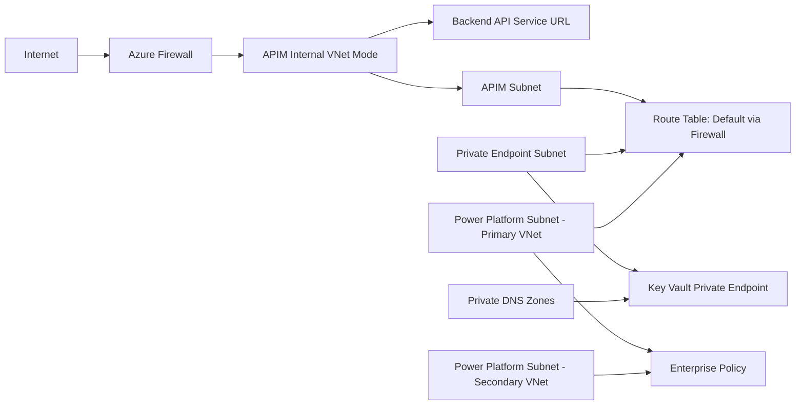

This repository provisions a secure Azure API platform for Infosys workloads using Terraform and Azure Verified Modules (AVM).

It creates:
- Resource Group
- Virtual Network with dedicated subnets for Firewall, APIM, Private Endpoints, and Power Platform
- APIM-focused NSG and additional NSGs
- Azure Firewall + Firewall Policy + Route Tables
- Key Vault with Private Endpoint and Private DNS integration
- Azure Monitor Log Analytics workspace and diagnostics
- API Management (APIM) service with imported OpenAPI specification
- APIM Product and Subscription
- Power Platform Enterprise Policy (Network Injection)
- Optional secondary Power Platform VNet in paired region + optional VNet peering

## Repository Structure

- [main.tf](main.tf): Core infrastructure resources and module orchestration
- [variables.tf](variables.tf): Input variables and validations
- [environments/prod/terraform.tfvars](environments/prod/terraform.tfvars): Production input values
- [environments/prod/backend.hcl](environments/prod/backend.hcl): Production state backend values
- [provider.tf](provider.tf): Terraform and provider requirements
- [backend.tf](backend.tf): Partial Azure Storage backend configuration
- [.terraform.lock.hcl](.terraform.lock.hcl): Locked provider versions
- [output.tf](output.tf): Key outputs after deployment
- [.github/workflows/terraform-pr.yml](.github/workflows/terraform-pr.yml): Pull request validation and plan
- [.github/workflows/terraform-deploy.yml](.github/workflows/terraform-deploy.yml): Approved environment deployment
- [openapi_infosys_travel_accommodation.yaml](openapi_infosys_travel_accommodation.yaml): OpenAPI file imported into APIM

## High-Level Architecture



## Prerequisites

- Terraform 1.5.0 or later
- Azure subscription with permissions to create networking, APIM, firewall, Key Vault, and policy resources
- Azure CLI authenticated to target subscription
- Access to register required Azure resource providers if not already registered

## Providers and Versions

Defined in [provider.tf](provider.tf):
- hashicorp/azurerm ~> 4.0
- azure/azapi ~> 2.0

## Backend

Defined in [backend.tf](backend.tf):

- Backend type: Azure Storage (`azurerm`)
- Authentication: Microsoft Entra ID

Environment-specific backend values are stored separately. The production backend in [environments/prod/backend.hcl](environments/prod/backend.hcl) uses:

- Resource group: `rg-infosys-terraform-state`
- Storage account: `stoinfyterrafromstate001`
- Blob container: `tfstate`
- State key: `infosys/ccd/prod/terraform.tfstate`

Each additional environment must use a unique state key. Never share one state key across environments.

Your Azure identity needs the Storage Blob Data Contributor role on the state container. The deployment identity also needs permission to manage resources in the target scope.

Authenticate, select the target subscription, and initialize the production backend:

```powershell
az login
az account set --subscription "<subscription-id-or-name>"
$env:ARM_USE_AZUREAD = "true"
terraform init -reconfigure -backend-config="environments/prod/backend.hcl"
```

> [!WARNING]
> Never commit Terraform state files. They can contain sensitive values. The repository ignores `.terraform/`, `*.tfstate`, and `*.tfstate.*`. Keep `.terraform.lock.hcl` committed so all environments use consistent provider versions.

## Configuration

Production values are stored in [environments/prod/terraform.tfvars](environments/prod/terraform.tfvars). Update an environment file through a feature branch and pull request.

Environment inputs include:

- Naming conventions
- CIDR ranges
- Region and Power Platform region pairing
- APIM SKU
- Power Platform enterprise policy name
- Resource tags

Important configuration notes:

- power_platform_region must be one of the allowed values in [variables.tf](variables.tf).
- resource_group_location should match one of the mapped Azure regions for the selected Power Platform geography to ensure correct primary/secondary pairing behavior.
- enable_vnet_peering can be set to true or false.
- If peering is false, network reachability between primary and secondary Power Platform VNets must still be guaranteed.
- Do not store passwords, client secrets, certificates, or API keys in a committed tfvars file.

### Add another environment

Create `environments/<environment>/backend.hcl` and `environments/<environment>/terraform.tfvars`. Use unique resource names, non-overlapping CIDR ranges, and a unique backend state key.

Add the environment name to:

- The matrix in [.github/workflows/terraform-pr.yml](.github/workflows/terraform-pr.yml)
- The workflow input options in [.github/workflows/terraform-deploy.yml](.github/workflows/terraform-deploy.yml)
- GitHub repository or environment configuration described in the pipeline setup section

## Local deployment

Run from the repository root:

```powershell
terraform init -reconfigure -backend-config="environments/prod/backend.hcl"
terraform fmt -recursive
terraform validate
terraform plan -var-file="environments/prod/terraform.tfvars" -out=tfplan
terraform apply tfplan
```

## GitHub pipeline setup

The workflows authenticate to Azure using OpenID Connect (OIDC). No Azure client secret is required.

Create protected GitHub Environments named `prod-plan` and `prod`. Add these variables to both environments:

- `AZURE_CLIENT_ID`
- `AZURE_TENANT_ID`
- `AZURE_SUBSCRIPTION_ID`

Configure required reviewers on both environments. Restrict `prod` deployments to `main`. The `prod-plan` environment should use a separate Azure identity with read-only access to production resources and only the state permissions required to initialize, lock, and read the Terraform state.

Create federated identity credentials on the Azure application or user-assigned managed identity for these subjects:

```text
repo:kmohansingh_microsoft/krish-test:environment:prod-plan
repo:kmohansingh_microsoft/krish-test:environment:prod
```

Grant the deployment identity:

- Storage Blob Data Contributor on the Terraform state container
- The required deployment role on the production target scope

Grant the plan identity:

- Storage Blob Data Contributor on the Terraform state container
- Reader on the production target scope

> [!IMPORTANT]
> Require approval for `prod-plan` before exposing its OIDC identity to pull request code. Review workflow and Terraform changes before approving the plan job.

### Pull request workflow

[.github/workflows/terraform-pr.yml](.github/workflows/terraform-pr.yml) requests approval for the `prod-plan` environment, then runs formatting, initialization, validation, and a production plan for pull requests targeting `main`. It never applies changes.

### Deployment workflow

[.github/workflows/terraform-deploy.yml](.github/workflows/terraform-deploy.yml) is manually started from GitHub Actions. It:

1. Runs only from `main`.
2. Requests access to the selected protected GitHub Environment.
3. Creates a fresh Terraform plan.
4. Applies that exact saved plan.

Environment-level concurrency and Azure blob leases prevent overlapping deployments against the same state.

## Protect the main branch

Create an active GitHub branch ruleset targeting `main` with:

- Pull requests required before merge
- At least one required approval
- Code Owner review required
- Stale approvals dismissed after new commits
- All conversations resolved
- `Terraform plan (prod)` required as a status check
- Branch required to be up to date
- Force pushes and branch deletion blocked
- No general-user bypass

The required status check becomes selectable after the pull request workflow has run successfully at least once.

## Deployment process

1. Create a feature branch.
2. Update Terraform code or `environments/prod/terraform.tfvars`.
3. Open a pull request to `main`.
4. Review the Terraform plan and obtain approval.
5. Merge the pull request.
6. Run the Terraform Deploy workflow from `main`.
7. Select `prod` and approve the protected environment deployment.

To destroy resources locally:

```powershell
terraform destroy -var-file="environments/prod/terraform.tfvars"
```

## What Gets Created

From [main.tf](main.tf), the deployment includes:
- Resource Group via AVM module
- APIM NSG with inbound/outbound rules for APIM networking requirements
- Primary VNet with 4 subnets:
- AzureFirewallSubnet
- APIM subnet
- Private Endpoint subnet
- Power Platform delegated subnet
- Key Vault with private endpoint in Private Endpoint subnet
- Private DNS zones for Key Vault, Blob, and File endpoints
- DNS zone links to primary VNet and conditional secondary VNet
- Azure Firewall and firewall policy with route table default route
- APIM in Internal mode, API import from OpenAPI, product, and subscription
- Secondary Power Platform VNet in paired region (conditional)
- Optional bidirectional VNet peering (conditional)
- ARM template deployment for Power Platform enterprise policy
- Log Analytics workspace + diagnostics

## Outputs

See [output.tf](output.tf) for exported values, including:
- Resource Group name and ID
- VNet and subnet IDs
- Secondary VNet details
- Firewall ID and private IP
- APIM ID
- VNet peering warning message

## How to Add More APIs

This project already contains one API configured in the apis block inside [main.tf](main.tf). To add more APIs, follow this process.

### Step 1: Add OpenAPI spec file

- Place your new OpenAPI file in the repo root or a dedicated folder.
- Keep naming clear, for example:
- openapi_order_management.yaml

### Step 2: Add API entry in APIM module

In module avm-res-apimanagement-service, extend the apis map with a new key.

Example pattern:

```hcl
apis = {
  "travel-accommodation-api" = {
    display_name = "Infosys Travel & Accommodation API"
    path         = "travel-accommodation"
    protocols    = ["https"]
    service_url  = "https://itgatewaytst.infosys.com/infydigital"
    api_type     = "http"
    import = {
      content_format = "openapi"
      content_value  = file("${path.module}/openapi_infosys_travel_accommodation.yaml")
    }
  }

  "order-management-api" = {
    display_name = "Order Management API"
    description  = "Order APIs"
    path         = "order-management"
    protocols    = ["https"]
    service_url  = "https://example.contoso.com/orders"
    subscription_required = true
    api_type     = "http"
    import = {
      content_format = "openapi"
      content_value  = file("${path.module}/openapi_order_management.yaml")
    }
    policy = {
      xml_content = <<-XML
<policies>
  <inbound>
    <base />
    <rate-limit-by-key calls="200" renewal-period="60" counter-key="@(context.Request.Headers.GetValueOrDefault("subscription-key", ""))" />
  </inbound>
  <backend>
    <base />
  </backend>
  <outbound>
    <base />
  </outbound>
  <on-error>
    <base />
  </on-error>
</policies>
XML
    }
  }
}
```

### Step 3: Add API to product

In the products map, update api_names to include the new API key.

Example:

```hcl
products = {
  "travel-accommodation-product" = {
    display_name = "Travel & Accommodation APIs"
    api_names    = [
      "travel-accommodation-api",
      "order-management-api"
    ]
    subscription_required = true
    approval_required     = false
    published             = true
  }
}
```

You can also create a separate product if lifecycle, audience, or access model is different.

### Step 4: Add subscription (optional but recommended)

Create a dedicated subscription per product or consumer group.

Example:

```hcl
subscriptions = {
  "travel-accommodation-subscription" = {
    display_name     = "Travel Accommodation Default Subscription"
    scope_type       = "product"
    scope_identifier = "travel-accommodation-product"
    state            = "active"
    allow_tracing    = true
  }

  "order-management-subscription" = {
    display_name     = "Order Management Subscription"
    scope_type       = "product"
    scope_identifier = "travel-accommodation-product"
    state            = "active"
    allow_tracing    = true
  }
}
```

### Step 5: Validate before apply

```powershell
terraform fmt -recursive
terraform validate
terraform plan
```

### Step 6: Apply

```powershell
terraform apply
```

### Step 7: Post-deployment checks

- Confirm API appears in APIM
- Confirm product association is correct
- Verify subscription keys are generated
- Test through APIM gateway endpoint
- Validate APIM policies (rate limit, headers, auth)

## API Onboarding Checklist

Use this checklist every time a new API is added:
- OpenAPI file is valid and committed
- Unique API key in apis map
- Unique path for APIM routing
- Correct backend service_url
- Product association updated
- Subscription strategy defined
- API-level and/or product-level policy reviewed
- Plan reviewed for unintended infrastructure changes
- Smoke tests executed after apply

## Security and Operations Notes

- APIM is configured in Internal VNet mode; ensure private connectivity from consumers.
- Key Vault public network access is disabled.
- Route table sends default egress via Azure Firewall.
- Diagnostic settings are enabled for key services into Log Analytics.
- Review NSG and firewall rules before production rollout.

## Recommended Improvements

- Separate environments using workspaces or separate tfvars files.
- Add CI/CD pipeline for fmt, validate, plan, and gated apply.
- Add policy-as-code checks (for example, Terraform compliance scanning).

## Troubleshooting

- Azure Storage returns HTTP 403:
- Confirm that the storage account name in [backend.tf](backend.tf) is exact.
- Confirm that the signed-in identity has Storage Blob Data Contributor access.
- Allow time for a new role assignment to propagate, then sign in again with Azure CLI.
- Set `$env:ARM_USE_AZUREAD = "true"` before running `terraform init`.
- Do not switch to key authentication when storage account keys are disabled.
- Region pairing mismatch:
- Verify power_platform_region and resource_group_location compatibility.
- API import failure:
- Validate OpenAPI syntax and APIM import compatibility.
- APIM connectivity issues:
- Check NSG rules, route table routes, firewall policy, and DNS links.
- Secondary VNet concerns:
- If peering disabled, ensure alternative routed connectivity exists.
